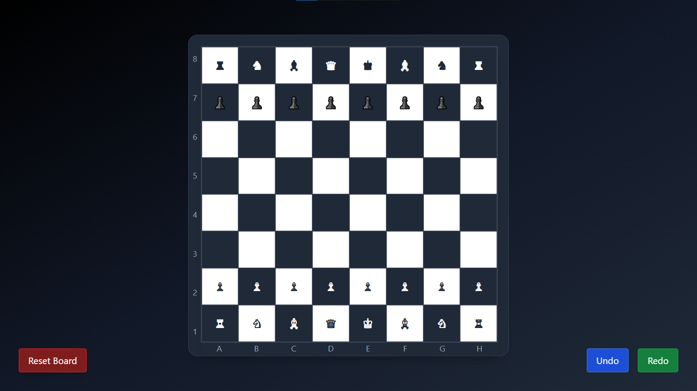

# ♟️ Chess Game

[View live demo here](https://chess.datturbomoon.space/)

A simple chess game I built, which chess players can use to test their moves.  

Made using:
- **HTML** + **Tailwind CSS**
- **Vanilla JavaScript** (no libraries)

Features:
- Basic legal move logic
- Turn-based play
- Checkmate and stalemate detection
- Undo / Redo buttons
- Reset anytime

Click a piece, make a move — that’s it.

I build little things like this to learn and improve.  
Feel free to use the code or mess around with it!

---
